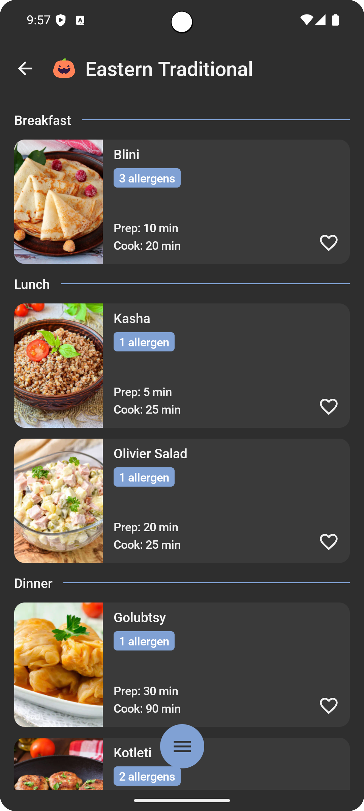
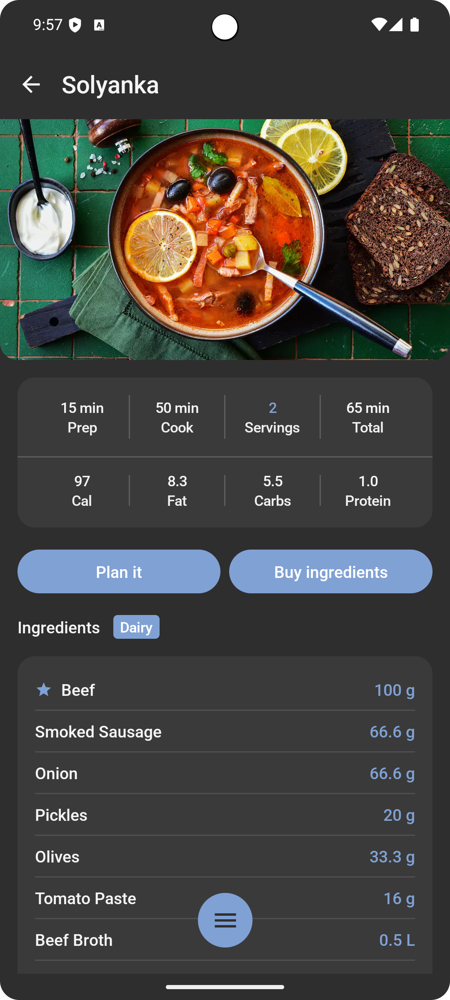
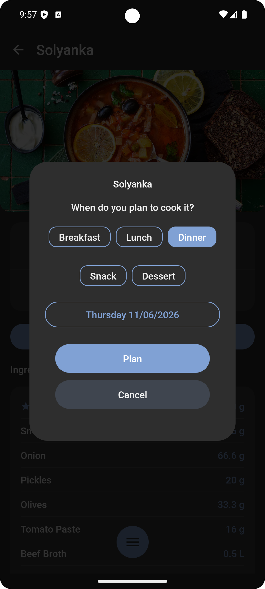
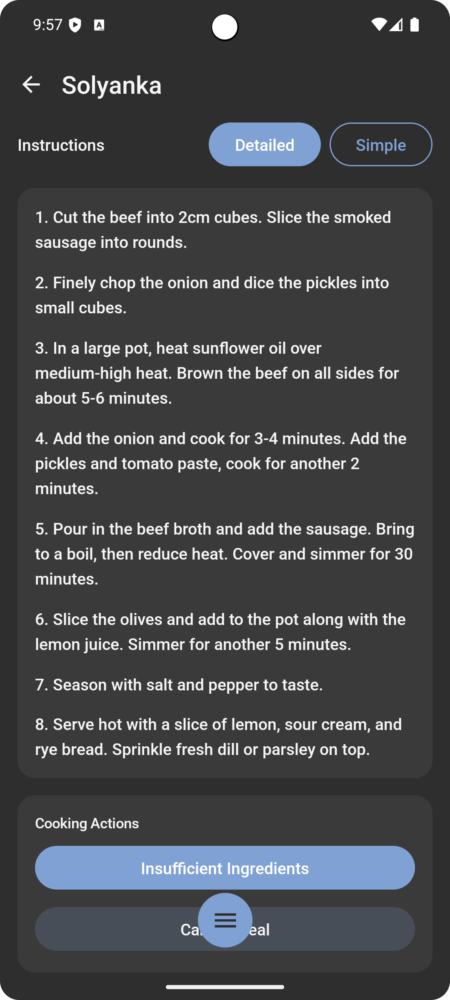
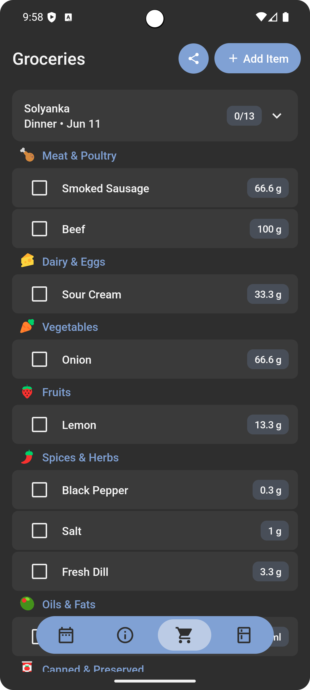
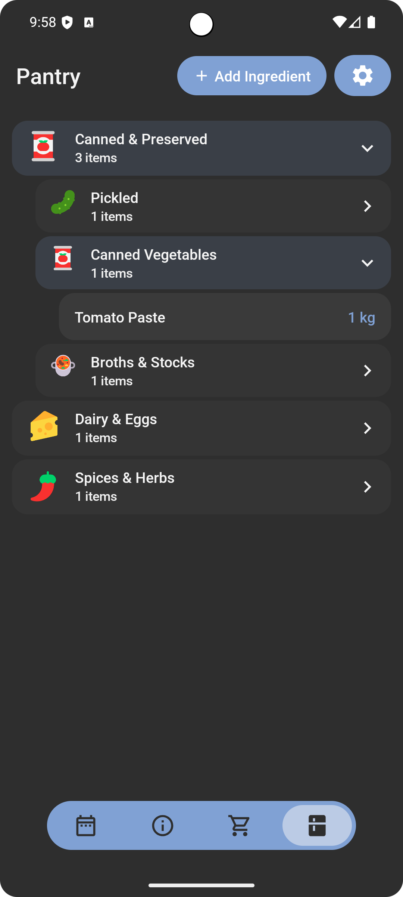

# Little Chef — Family Meal Planner

AI-powered meal planning app for Android. Plan meals, scale servings, track pantry inventory, generate grocery lists, and cook with step-by-step cooking mode — all offline-first with 200 bundled recipes.

**Stack:** Kotlin · Jetpack Compose · Material 3 · Clean Architecture + MVVM · Dagger Hilt · Room · DataStore

🌐 **Website:** [inquisitor2000.github.io/Little_Chef](https://inquisitor2000.github.io/Little_Chef/) — landing page, privacy policy & terms

## Screenshots

<table>
  <tr>
    <td></td>
    <td></td>
    <td></td>
  </tr>
  <tr>
    <td></td>
    <td></td>
    <td></td>
  </tr>
</table>

## Tech Stack

| Layer | Technology |
|-------|-----------|
| UI | Jetpack Compose + Material 3 (BOM 2023.10.01) |
| Architecture | Clean Architecture (data/domain/ui layers) + MVVM |
| DI | Dagger Hilt 2.48.1 |
| Database | Room 2.6.1 with KSP |
| Preferences | DataStore Preferences |
| Navigation | Navigation Compose 2.7.6 |
| Image Loading | Coil Compose 2.5.0 |
| HTTP Client | Ktor 2.3.7 (OkHttp engine) |
| AI | OpenAI API integration via Ktor |
| Serialization | Kotlinx Serialization 1.6.2 |
| Fonts | Google Fonts via Compose |
| Tests | Kotest 5.8.0 + Robolectric 4.11.1 + MockK 1.13.8 |

**Build:** Kotlin 1.9.21 · AGP 8.2.2 · Min SDK 27 · Target SDK 34 · JVM 17

## Architecture

```
com.littlechef.app/
├── data/
│   ├── local/          # Room DB (9 entities), DAOs, bundled recipe loader
│   ├── preferences/    # DataStore preferences (onboarding, locale, theme)
│   ├── remote/         # Ktor HTTP client, OpenAI service
│   └── repository/     # Repository implementations
├── domain/
│   ├── model/          # Business models (Meal, MealPlan, NutritionInfo, etc.)
│   ├── repository/     # Repository interfaces
│   └── usecase/        # Use cases (StartCooking, CheckRecipeIngredients, etc.)
├── ui/
│   ├── components/     # Shared composables (NutritionCard, etc.)
│   ├── navigation/     # NavHost + sealed NavDestination routes
│   ├── onboarding/     # 3-step onboarding (language, welcome, serving size)
│   ├── screens/        # All screens + ViewModels
│   ├── theme/          # Material 3 theme, colors, typography
│   └── util/           # QuantityStepper, formatting, haptics
├── di/                 # Hilt modules (5 modules)
└── utils/              # App-level utilities
```

## Database (Room)

9 entities: `IngredientEntity`, `MealEntity`, `MealIngredientEntity`, `MealPlanEntity`, `AllergenEntity`, `IngredientAllergenEntity`, `IngredientSubstituteEntity`, `InventoryTransactionEntity`, `GroceryItemEntity`.

Relationships:
- Meal 1→N MealIngredient N→1 Ingredient
- Ingredient N→N Allergen (via IngredientAllergen)
- Ingredient N→N Ingredient (substitutes, via IngredientSubstitute)
- MealPlan → Meal with per-plan serving overrides

## Key Features

### Recipe Library — 230+ Bundled Recipes
- 14 cuisines (Asian, Italian, Mexican, French, Mediterranean, Eastern Traditional, Exotic Tropics, Two Fast Two Hungry, etc.)
- JSON-based recipe bundles loaded from assets
- All recipes free and included — no in-app purchases or DLC
- Each recipe: ingredients with quantities, prep/cook time, servings, instructions + simple instructions
- Per-recipe nutrition labels (calories, fats, carbs, protein per serving)

### Serving Size Scaling
- User-adjustable servings (1–6) via stepper or tap-to-cycle
- Ingredient quantities scale proportionally with `selectedServings / originalServings`
- Prep time adjusts ~35% per scaling ratio; cook time adjusts ~5%
- Unified `TimeAdjuster` utility ensures preview cards and detail screens show identical times
- Egg quantities round to nearest 0.5 (for partial-egg scenarios)
- Per-plan serving overrides persisted in `MealPlan.plannedServings`
- Default serving size set during onboarding (DataStore)

### Ingredient Catalog
- 523 hardcoded `CatalogIngredient` entries with 15 categories, subcategories, allergens
- Fuzzy ingredient name matching for bundled recipe → catalog linking
- 9 FDA allergens tracked: gluten, dairy, eggs, tree nuts, peanuts, soy, fish, shellfish, sesame
- Allergen chips displayed on all recipe detail screens

### Meal Planning
- Calendar-based meal plan with per-day, per-meal-type slots
- Drag-to-reorder meals, multi-day planning
- Grocery list auto-generated from planned meals (merges duplicates, subtracts pantry stock)
- Inventory tracking via `InventoryTransactionEntity` (add/remove/consume)

### Grocery List
- Auto-generated from meal plans with ingredient merging
- Quick ingredient search with catalog matching
- Custom header naming, category-based sorting
- Text export for sharing

### Recipe Scraping
- OpenAI API integration to scrape recipe URLs into structured recipe data
- Manual recipe creation with full ingredient editing
- Screenshot-based voice ingredient review with quantity adjustment

### Onboarding
- 3-step flow: Language Selection → Welcome → Serving Size
- Serving size stepper (1–6, ± buttons)
- Supported locales: English, Russian, Romanian
- Translated ingredient names, categories, recipes, and UI strings

### Smart Cooking Mode (Meal Plan Detail)
- Start/complete/abort meal cooking flow
- Ingredient substitution management with revert
- Insufficient ingredient warnings
- Inventory auto-deduction on cook complete

## Running

```bash
# Debug build
./gradlew assembleDebug

# Tests
./gradlew test

# Generate Room schema
./gradlew :app:kspDebugKotlin
```

## Project Structure

```
Little_Chef/
├── app/                          # Main application module
│   └── src/main/
│   ├── assets/
│   │   ├── recipes/          # 230+ bundled recipes (14 cuisines)
│   │   └── translations/     # RU/RO ingredient & category translations
│   ├── java/com/littlechef/app/
│   └── res/                  # Layouts, strings (en/ru/ro), themes
├── scraper/                      # Recipe scraping scripts
└── onboard/                      # Onboarding assets
```

All 230+ recipes are fully translated in English, Romanian, and Russian — no in-app purchases, no downloads, everything included in the app.
